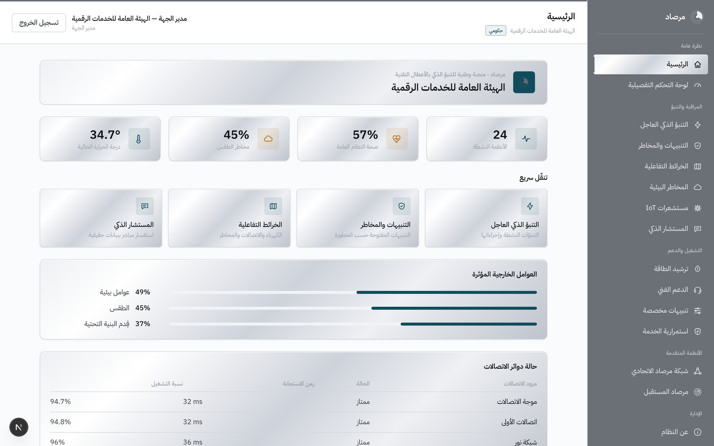
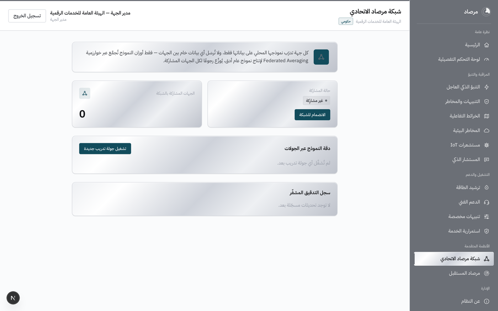
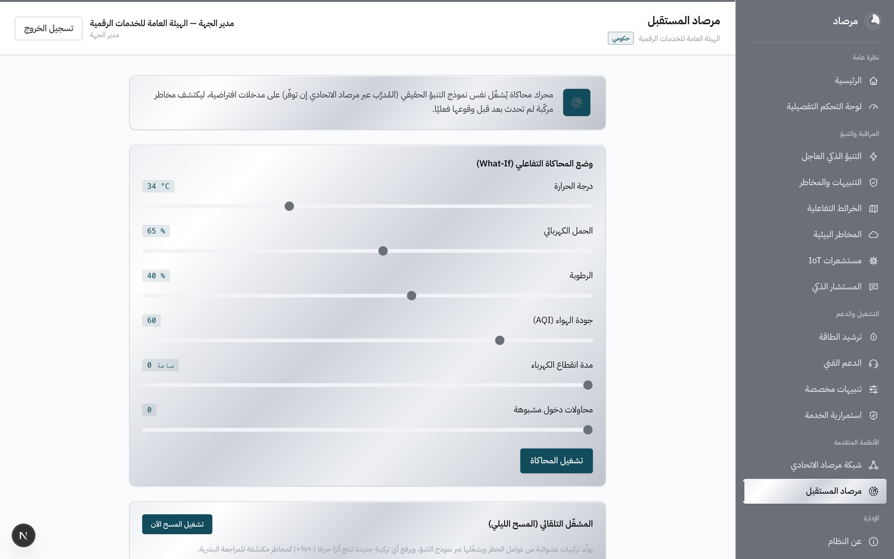

<div dir="rtl">

# مرصاد — منصة وطنية للتنبؤ الذكي بالأعطال التقنية

مرصاد منصة متعددة الجهات (Multi-Tenant) قابلة للإعداد لأي جهة — حكومية، صحية، أو خاصة — تجمع قراءات الكهرباء والاتصالات والطقس وأجهزة الاستشعار (IoT) في مكان واحد للتنبؤ بالأعطال قبل وقوعها، وتضيف طبقتين تتجاوزان فكرة "لوحة التنبؤ" التقليدية: شبكة تعلّم اتحادي حقيقية بين الجهات (Federated Averaging) دون مشاركة أي بيانات خام، وتوأم رقمي يشغّل نفس نموذج التنبؤ على سيناريوهات افتراضية لاكتشاف مخاطر مركّبة قبل حدوثها فعليًا.

**الموقع المباشر:** [web-production-d0230.up.railway.app](https://web-production-d0230.up.railway.app)

*ملاحظة: بيانات الجهات الثلاث المزروعة (حكومية، صحية، خاصة) تجريبية بالكامل، وُضعت لإثبات أن النظام يعمل فعليًا من قاعدة البيانات إلى الخوارزميات — لا تعكس بيانات تشغيلية حقيقية من أي جهة.*

## نظرة عامة

على عكس نموذج أولي بواجهة أمامية فقط، مرصاد منصة Full-stack كاملة بخادم حقيقي وقاعدة بيانات وخدمة ذكاء اصطناعي مستقلة: عزل بيانات فعلي بين الجهات على مستوى قاعدة البيانات (Row-Level Security)، مصادقة بكوكيز httpOnly، وخوارزمية تعلّم اتحادي (FedAvg) مُختبَرة بوحدات اختبار آلية — لا مجرد واجهة عرض فوق بيانات ثابتة.

## الأهداف

- توحيد مراقبة الكهرباء والاتصالات والطقس وأجهزة الاستشعار في لوحة واحدة لكل جهة.
- بناء نموذج تنبؤ فعلي يحدد نافذة زمنية ومستوى ثقة للعطل المحتمل، لا تنبيهات عامة فقط.
- تمكين الجهات من التعلّم من خبرة بعضها البعض دون مشاركة أي بيانات خام حساسة.
- اختبار سيناريوهات مستقبلية مركّبة قبل وقوعها، وتجهيز خطط استجابة جاهزة للتفعيل الفوري.
- ربط المخاطر المكتشفة مباشرة بالخدمات المجدولة للمستفيدين لاقتراح إجراءات استباقية قبل تأثرهم.

## الميزات

**المراقبة والتنبؤ:** لوحة رئيسية وتفصيلية، تنبؤ ذكي عاجل بنافذة زمنية وثقة، تنبيهات ومخاطر موحّدة، أربع خرائط تفاعلية حية (كهرباء، اتصالات، مخاطر، طقس).

**الاستشعار والبيئة:** مستشعرات IoT حية (حرارة، رطوبة، جودة هواء، تسرّب مياه)، مخاطر بيئية، ترشيد استهلاك الطاقة.

**التشغيل والدعم:** مصفوفة تصعيد زمنية آلية، إشعارات متعددة القنوات (تطبيق، بريد، رسالة نصية، واتساب، اتصال آلي)، تفضيلات تنبيه قابلة للتخصيص حسب الدور.

**المستشار الذكي:** يستعلم فعليًا من قاعدة البيانات الحيّة قبل الإجابة (RAG حقيقي) — لا يخترع أرقامًا.

**شبكة مرصاد الاتحادي:** كل جهة تُدرّب نموذجها محليًا، وتُشارك أوزان النموذج فقط عبر Federated Averaging، مع سجل تدقيق مشفّر (Hash Chain) لكل تحديث.

**مرصاد المستقبل:** محرك محاكاة (توأم رقمي) بوضع تفاعلي (What-If) ومسح تلقائي ليلي يكتشف مخاطر مركّبة لم تحدث بعد، وينتج خطط طوارئ قابلة للتفعيل الفوري.

**الحوكمة:** سجل تدقيق كامل لكل إجراء، معالج إعداد جهة جديدة ذاتي (`/setup`)، عزل بيانات صارم بين الجهات.

## التقنيات المستخدمة

| الطبقة | التقنية |
|---|---|
| الواجهة الأمامية | Next.js 16 (App Router) + TypeScript + Tailwind CSS v4 — RTL كامل، i18n بملفات JSON |
| الخادم الرئيسي | NestJS + TypeScript + Prisma ORM |
| خدمة الذكاء الاصطناعي | FastAPI (Python) + NumPy — تدريب/تجميع شبكة مرصاد الاتحادي (Federated Averaging حقيقي) |
| قاعدة البيانات | PostgreSQL |
| البنية | Monorepo بـ npm workspaces (`apps/web`, `apps/api`, `apps/ml`, `packages/shared`) |
| التشغيل | Docker Compose (postgres + api + web + ml بأمر واحد)، نشر تلقائي (CI/CD) على Railway |

## هيكل المشروع

```
مرصاد/
  apps/
    web/      # Next.js — الواجهة الأمامية
    api/      # NestJS + Prisma — الـ API الرئيسي
    ml/       # FastAPI — خدمة الذكاء الاصطناعي (تدريب/تجميع Federated Averaging)
  packages/
    shared/   # أنواع TypeScript مشتركة (الأدوار، الجهات، مسميات عربية...)
  infra/
    postgres-init/   # سكربت إنشاء دور التطبيق المحدود بحاوية Postgres (RLS)
  docs/
    screenshots/      # لقطات شاشة حية من المنصة
  .github/workflows/  # CI — بناء + اختبارات
  docker-compose.yml
  .env.example
  ARCHITECTURE.md
```

## خطوات التشغيل

### عبر Docker Compose (موصى به للتشغيل الكامل)

```bash
cp .env.example .env
docker compose up --build
```

- الواجهة: http://localhost:3000
- الـ API: http://localhost:4000
- خدمة الذكاء الاصطناعي: http://localhost:8000/health

عند أول تشغيل، نفّذي الترحيل والبذر داخل حاوية الـ API:

```bash
docker compose exec api npx prisma migrate deploy
docker compose exec api npx prisma db seed
```

### تشغيل مباشر بدون Docker (يتطلب PostgreSQL محليًا)

```bash
npm install

# الـ API
cd apps/api
cp .env.example .env   # عدّلي DATABASE_URL و MIGRATOR_DATABASE_URL وفق دوري القاعدة لديك
npx prisma migrate dev
npx prisma db seed
npm run start:dev       # http://localhost:4000

# الواجهة (بنافذة طرفية أخرى)
cd apps/web
npm run dev              # http://localhost:3000
```

راجعي [ARCHITECTURE.md](ARCHITECTURE.md) لتفاصيل عزل الجهات (Row-Level Security) ودوري قاعدة البيانات المطلوبين.

## الاختبارات

منطق Federated Averaging (شبكة مرصاد الاتحادي) مُختبَر بوحدات اختبار حقيقية:

```bash
cd apps/ml
python3 -m venv .venv && source .venv/bin/activate
pip install -r requirements.txt
python -m pytest tests/ -v
```

## لقطات شاشة

| اللوحة الرئيسية | شبكة مرصاد الاتحادي |
|---|---|
|  |  |

| مرصاد المستقبل |
|---|
|  |

## بيانات الدخول التجريبية

بعد تنفيذ `prisma db seed` تُنشأ 3 جهات توضيحية، لكل منها مستخدم لكل دور من الأدوار السبعة. كلمة المرور لجميع الحسابات: `Marsad@2026`

| الجهة | نوعها | مثال حساب (مدير الجهة) |
|---|---|---|
| الهيئة العامة للخدمات الرقمية | حكومي | `tenant-admin@gov.marsad.local` |
| مستشفى الأمل التخصصي | صحي | `tenant-admin@health.marsad.local` |
| شركة النسيج التقنية | خاص | `tenant-admin@corp.marsad.local` |

بدلًا من بيانات الزرع، يمكن أيضًا إنشاء جهة جديدة فعليًا عبر معالج الإعداد الذاتي على `/setup` — راجعي ARCHITECTURE.md "معالج إعداد جهة جديدة".

## الأدوار السبعة الافتراضية

مدير النظام، مدير الجهة، مدير المنطقة، مهندس الدعم الفني، مركز العمليات، مدير الفرع/الموقع، مستخدم عادي — معرّفة بـ [packages/shared/src/roles.ts](packages/shared/src/roles.ts) وتُزرع تلقائيًا لكل جهة جديدة.

## قاعدة البيانات

المخطط الكامل بـ [apps/api/prisma/schema.prisma](apps/api/prisma/schema.prisma) مصمَّم ليغطي كل وحدات المنصة (تعدد الجهات، أجهزة الاستشعار، التنبؤ والمخاطر، التنبيهات والتصعيد، ترشيد الطاقة، المستشار الذكي، الشبكة الاتحادية، التوأم الرقمي، استمرارية الخدمة) — راجعي [ARCHITECTURE.md](ARCHITECTURE.md) لتفاصيل كل مجموعة جداول وربطها بشاشات المنصة.

## التطوير المستقبلي

- ربط فعلي بمزوّدي القراءات الحقيقية (عدادات الطاقة، شبكات الاتصالات، محطات الطقس) بدل بيانات المحاكاة الحالية.
- تدريب النماذج على سجلات أعطال تاريخية فعلية لكل جهة بدل البيانات التجريبية.
- تطبيق جوال مرافق مع دعم الإشعارات الفورية.
- دومين مخصص للمنصة بدل النطاق الفرعي الحالي.
- توسيع شبكة التعلّم المشترك لتشمل عددًا أكبر من الجهات لتحسين دقة النموذج العام.

## فريق العمل

| الدور | الاسم |
|---|---|
| إشراف | عبدالرحمن بن علي المعارك — وكالة التحول الرقمي وتقنية المعلومات |
| إعداد وتنفيذ | ريام منصور العتيبي |

</div>
